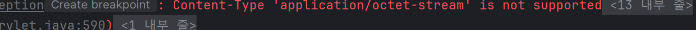
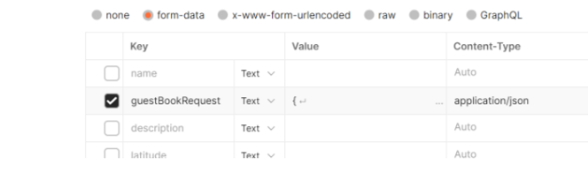

# Content-Type ‘application/octet-stream’ is not supported
작성자: 박강락
## 1. 문제 상황

S3 이미지 업로드시 DTO 와 함께 보내는경우 Json 형식으로만 보낼수 없어 다음과 같은 에러 발생

## 2. 원인

dto, 사진파일 두가지를 보낼떄 각각의 Content-type을 따로 설정해주지 못하는 문제

## 3. 해결 방안

**@RequestPart 사용하여 json 부분만 따로 컨텐츠 타입을 부여**