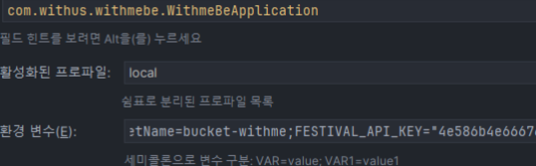

# Error creating bean with name 's3Config': Injection of autowired dependencies failed 에러
작성자: 박강락

## 1. 문제 상황

s3이미지 연동시

Error creating bean with name 's3Config': Injection of autowired dependencies failed 에러 발생

## 2. 원인

S3 환경변수값이 정확히 입력되지 않았거나, 누락

## 3. 해결 방안

수정 후 정상작동