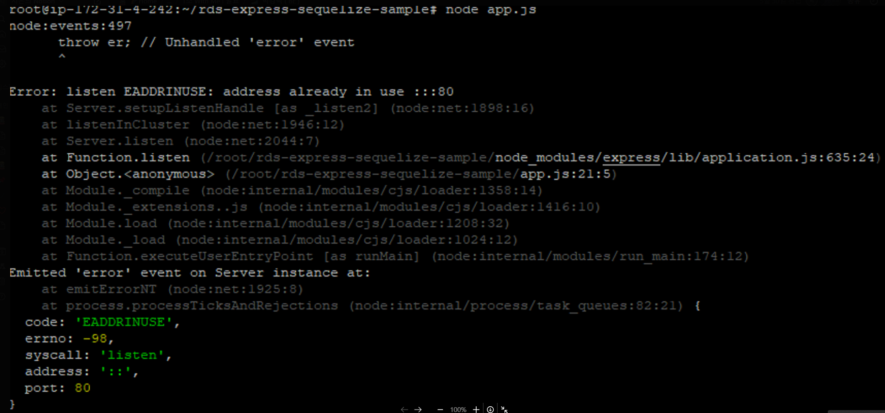
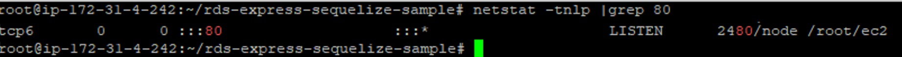
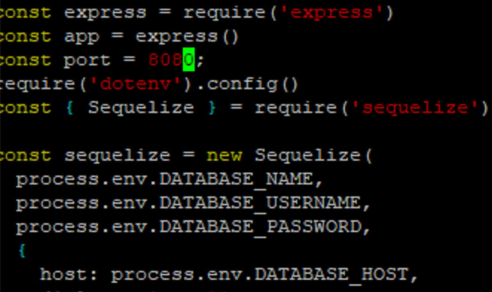
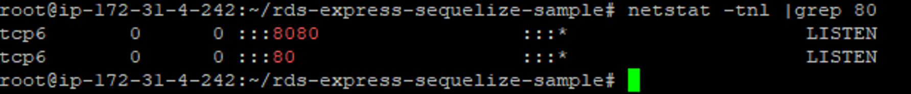

# Error: listen EADDRINUSE: address already in use :::80
작성자: 박강락
## 1. 문제 상황

서버 배포 작업중, 해당포트가 이미 사용하고 있다는 에러발생

## 2. 원인

netstat 명령어를 통해 사용하고 있는 포트 확인

## 3. 해결 방안

사용중인 포트가 중요하거나 필요한 포트인경우, 새롭게 추가하는 포트 번호를 변경

netstat 으로 확인후 사용중인 포트가 중요하지 않는경우 kill -9 {프로세스번호} 로 삭제