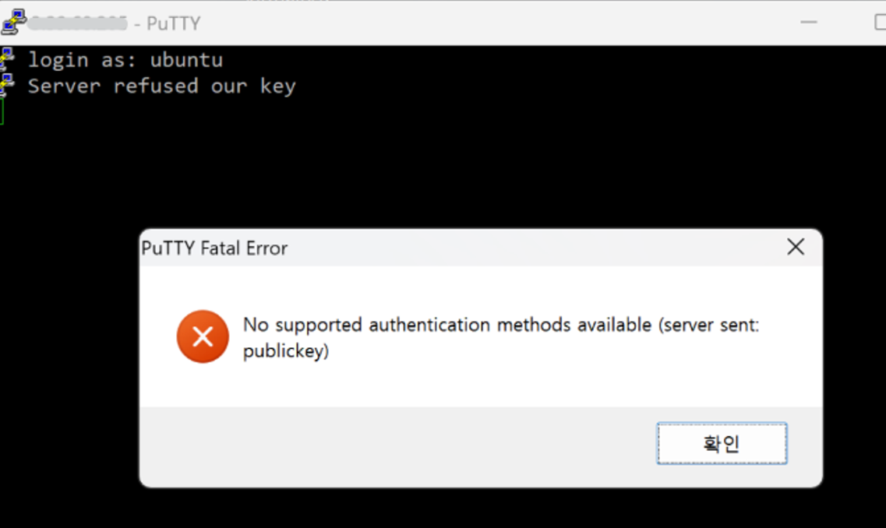
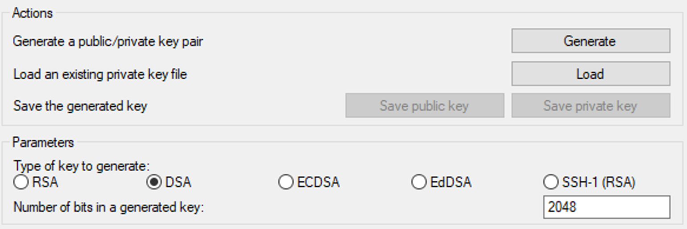
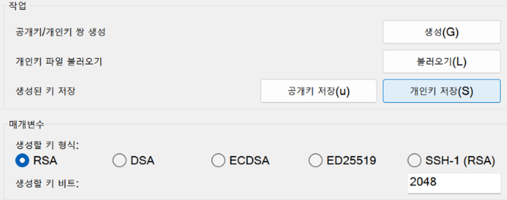
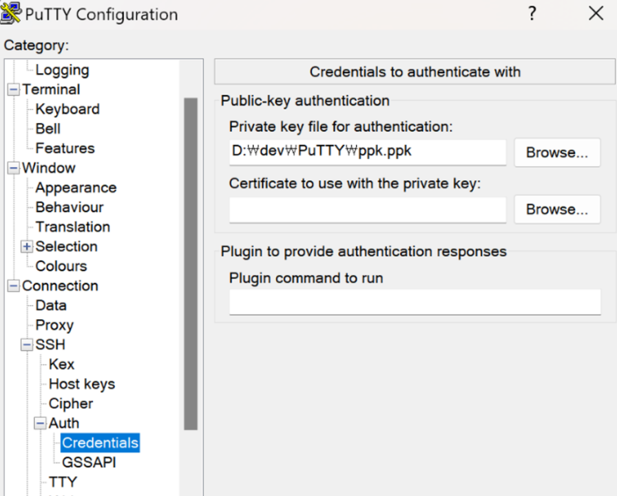
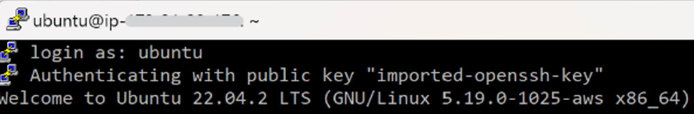

# PuTTY로 EC2 인스턴스 접속 시도 시, No supported authentication methods available (server sent: publickey)
작성자: 박강락
## 1. 문제 상황

lPuTTY로 EC2 인스턴스에 접속을 시도하던 도중 `No supported authentication methods available (server sent: publickey)` 에러 발생

## 2. 원인

암호화 Key 방식을 맟줘주지 않아 에러 발생

## 3. 해결 방안

PuTTYgen으로 `변환` > `키 불러오기` > `.pem 파일 선택` > `개인키 저장(save private key)` 순서대로 private key를 생성

## 4. 대안

Connection > SSH > Auth > Credentials > private key file for authentication에 생성한 private-key.ppk 파일 불러오기 > 우측 하단의 Open클릭

