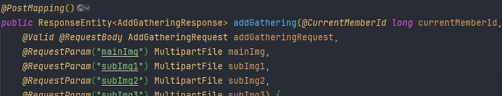
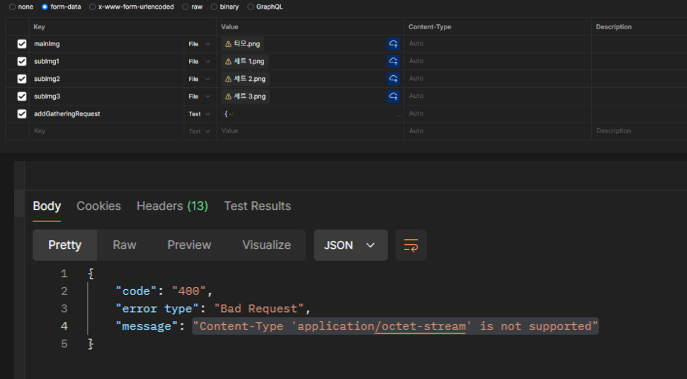
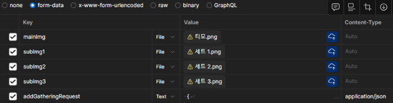
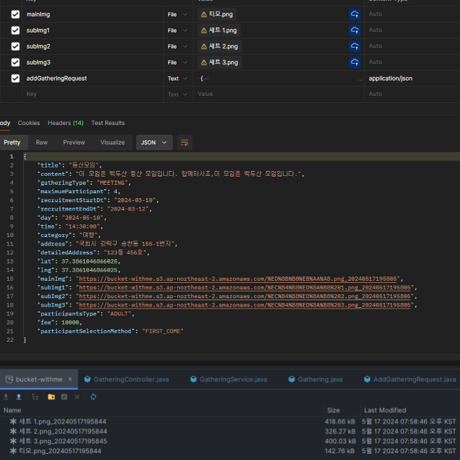

# "Unsupported Media Type""Content-Type 'application/octet-stream' is not supported”
작성자: 박강락
## 1. 문제 상황
"Unsupported Media Type"  에러발생

## 2. 원인

@RequstParam, @RequstBody 같이 사용해야되는경우

@RequestPart 로 변경해서 보낸다.

RequestPart 로 변경하는경우

Body-form-data 형식로 (키-밸류)  데이터를 보내야 하는데

addGatheringRequest 쪽의 Value값 부분을 Json 형식으로 받아들이지 못함

Content-Type을 Json 형식으로 명시해주면된다.

## 3. 해결 방안

수정 후 정상작동