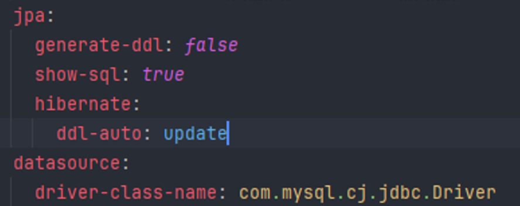
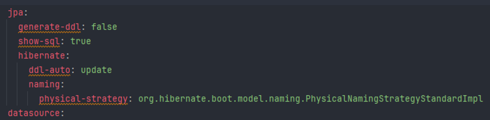
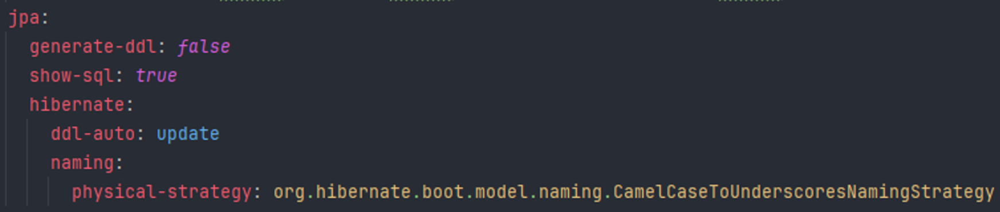
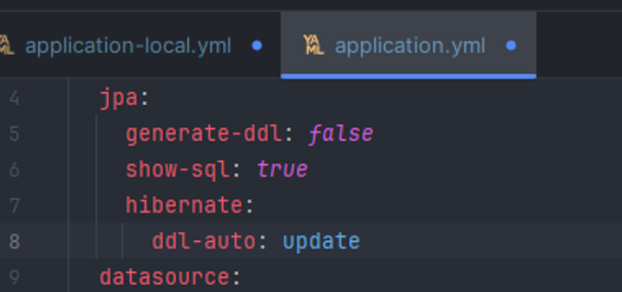

# yml 설정파일 케이스 오류
작성자: 박강락
## 1. 문제 상황

local.yml 별도 네이밍 설정이 없는경우 디폴트값으로 스네이크 케이스 방식으로 컬럼명이 생성되야 하지만, 카멜케이스방식으로 만들어짐

## 2. 원인

스프링 실행시 local 실행으로 설정하더라도 application.yml 을 비교해서 없는설정을 가져옴

## 3. 해결 방안

네이밍 설정에 스네이크케이스로 만들어지도록 설정

## 4. 대안

local과 마찬가지로 환경을 똑같이 맞춰준다.