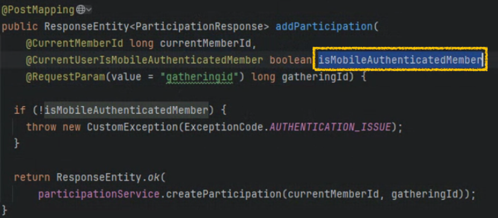

# API 통신 에러
작성자: 이수광

## 1. 문제 상황

모임참여 ( 참여하기 버튼 클릭 → 참여신청 통신 )

API 명세서를 참고하여, 토큰과 해당 모임의 ID를 첨부하여 통신을 보냈습니다.
200 OK 가 나오지만 받아야할 응답에 아무런 데이터가 나타나지 않았습니다.

이 부분에서 담당 백엔드와 함께 화면을 공유하며 통신 형태에 잘못된 부분이 있는지 함께 체크하고,

원인 파악을 위해 빠르게 원인을 찾아서 해결하려 했으나 오랜 시간을 할애했습니다.

프론트 : API 명세서를 참고했고, 백엔드와 함께 통신 형태를 봤을 때 문제가 없을을 확인 이유를 잘 모르겠다.

백엔드 : 200 OK 가 나오지만 응답이없다. 200 OK 나왔다는 것은 서버와 접촉이 있었다는 것인데, 로그가 남아있지 않아서 수상하다.

## 2. 원인
이에 위 사진과 같이 백에서 기능 제작하며 만든 데이터 양식은

CurrentMemberId, isMobileAuthenticatiedMember, RequestParam

여기서 isMobileAuthenticatiedMember 는 서버 통신시 필요하지 않기 때문에 명세서 기입안했지만

해당 기능에 요구하는 데이터는 3개 였기 때문에 빈값이라도 body에 실어서 보냈어야 함이 문제였습니다.

## 3. 해결 방안
여러 시도를 하다가 null을 넣어 보낸 상황에서 통신이 정상적으로 작동하는 것을 확인하고, 함께 이야기했습니다.

[ 느낀점 ]

통신은 어렵다.

처음에는 console.log(res)로 통신 요청 코드의 결과만 보면서 확인했었고,

이후에는 개발자 도구 네트워크 탭을 활용해 더 자세히 통신 상태를 확인하고 파악하는 등 성장했지만

실제 서버와의 통신은 여러 방면에서 더 생각해봐야함을 느꼈습니다. ( 백엔드도 예상하지 못했던 문제 )

차후 미래를 위해서라도 백엔드 지식과 코드를 어느정도는 공부해야겠다를 느꼈습니다.

현재는 기능이 정상 작동하고, 백엔드께서 코드를 수정하겠다하고 마무리되었습니다.