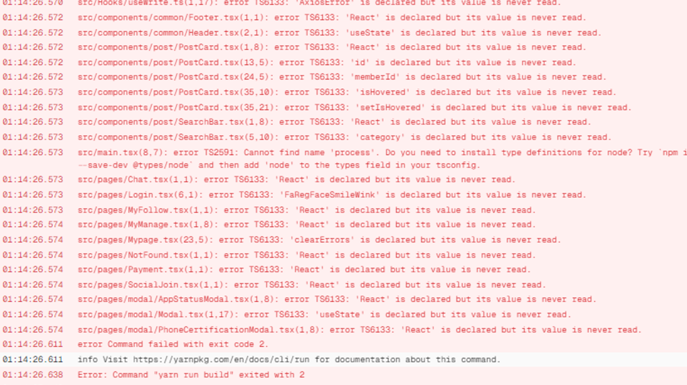

# vercel 배포
작성자: 우승찬

## 1. 문제 상황

vercel 배포하는 과정에서 생겨난 에러 코드를 만났습니다

## 2. 원인

vercel을 배포하는 과정에서 typescript 에러와 사용하지 않는 변수들로 인한 에러로 인해 배포가 되지 않는 상황이었습니다

## 3. 해결 방안

사용하지 않는 변수들을 다 제거한 후에 타입 지정이 명확하지 않는 변수들을 지정해줬습니다

### [Weekly Review]

개발을 할 때 사용되지 않는 변수나 필요하지 않는 변수 선언을 최대한 사용하지 않고 잘 제거해줘야 한다는걸 뼈저리게 배웠습니다…+ ESlint , prettier 설정