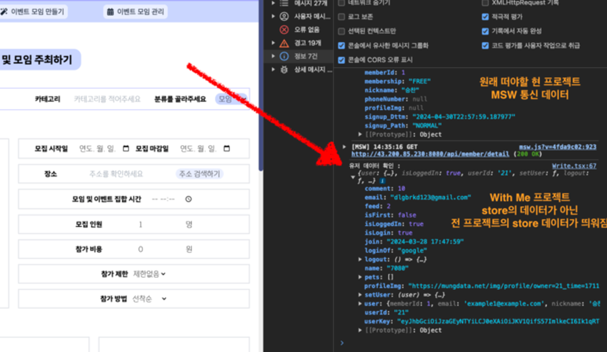

# 로컬 데이터 공유 오류
작성자: 이수광
## 1. 문제 상황

프로젝트 진행시 MSW 를 활용하여 기능을 구현하는데 계속해서 현재 프로젝트의 MSW 데이터가 아닌

이전의 개인프로젝트 데이터를 가져와서 곤란을 겪었다. 

## 2. 원인
이유를 알 수가 없었는데 인터넷 옵션 관련 문제.

origin 이 같으면 localStorage가 공유되는 문제에 대해서 잘 몰랐었다.

## 3. 해결 방안

origin 기반으로 쿠키가 구워지고 하니까 항상 삭제하는 습관을 들이자.