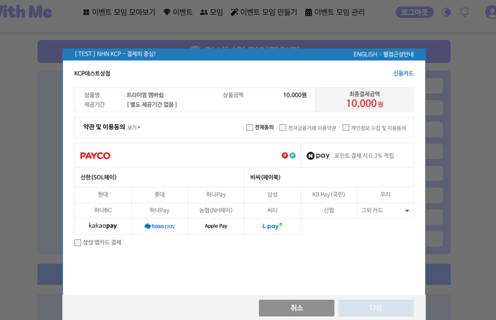

# 우당탕탕 KCP 결제 소동
작성자: 이수광
## 1. 문제 상황

카드 결제 기능을 백엔드분과 함께 작업하며 실제로 돈이 나가진 않죠 ? 와 그렇다의 대화로 함께

실시간으로 테스트하며 기능을 구현하고 테스트를 하며 실제로 결제창이 완료되고 넘어가도 실제 청구 금액은 발생하지 않았으나 기능을 완성하고 한 테스트 2번에 번당 만원씩의 금액이 실제로 결제된 것을 확인.

## 2. 원인
백엔드와 함께 당황하여 원인을 찾아보니 [ 카카오페이 ] 를 제외한 결제는 테스트코드로 실제 결제가 되지 않습니다 란 공식문서를 보고 당황해버렸다.

## 3. 해결 방안
어떻게 KCP에 연락하여 결제 취소 요청을 할 수 있었습니다.

[ 느낀점 ]

해당 API를 사용할 때 필요한 부분만 읽고 기능을 완수하는데만 집중하지 말고 차분히 전부 읽어보자.

실제 금액이 지출되면서 뼈저리게 공식문서를 꼼꼼히 읽어야함을 배웠습니다.

트러블 슈팅이라기 보다는 백엔드와 함께 처음하는 기능을 구현하면서 설레발 치면서 만들다가 실 결제가 되자 둘이 당황하면서 어떡하지란 재밌는 기억이 남았습니다. 또한 카드결제에 대한 과정도 배울 수 있었습니다.